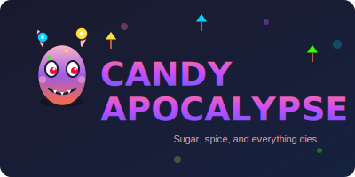
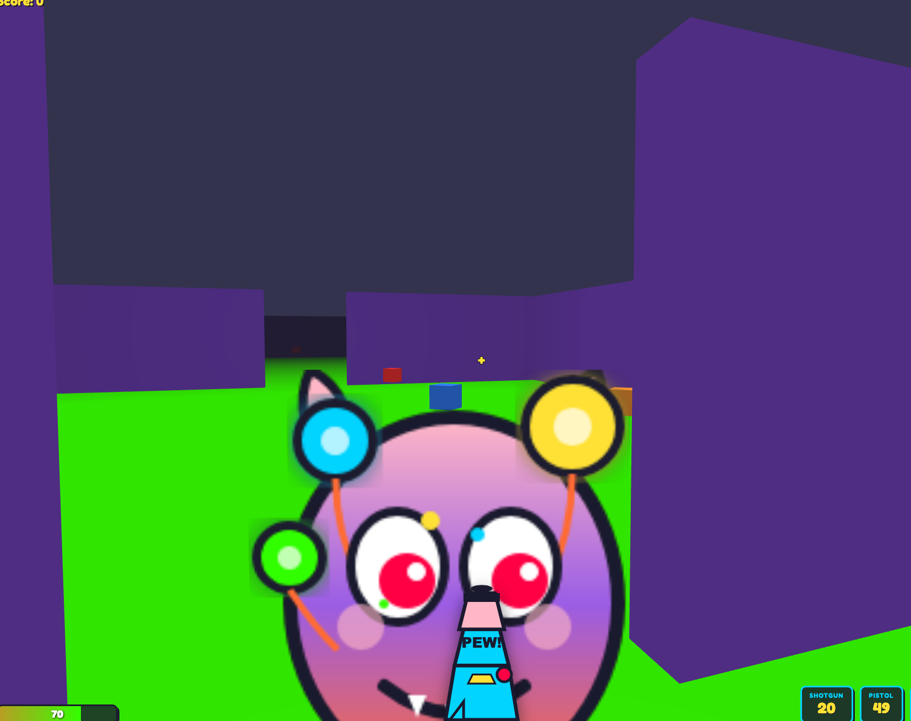

<p align="center">
  
</p>

<h1 align="center">Candy Apocalypse</h1>

<p align="center">
  <em>"Sugar, spice, and everything dies."</em>
</p>

<p align="center">
  🎮 <strong>Play it now:</strong> <a href="https://karma-works.github.io/candy-apocalypse/">https://karma-works.github.io/candy-apocalypse/</a>
</p>

<p align="center">
  
</p>

A delightfully chaotic browser game built with Babylon.js, featuring first-person gameplay with cartoon-style visuals.

## Tech Stack

- **Engine**: Babylon.js
- **UI**: React + TypeScript
- **State**: Zustand
- **Build**: Vite
- **Testing**: Vitest + Playwright

## Getting Started

### Prerequisites

- Node.js 18+
- pnpm (package manager)

### Installation

```bash
# Install dependencies
pnpm install

# Start development server
pnpm dev

# Build for production
pnpm build

# Run tests
pnpm test
```

## Project Structure

```
src/
├── engine/              # Engine layer (rendering, input, audio)
├── game/                # Game layer (entities, state, levels)
└── ui/                  # React UI components
```

## Controls

- **WASD**: Move
- **Mouse**: Look around
- **Click**: Lock pointer
- **ESC**: Unlock pointer

## Development Status

See [REWRITE_PROGRESS.md](./docs/REWRITE_PROGRESS.md) for current status.

## Key Design Documents

- **[Rewrite Plan](./docs/REWRITE_PLAN.md)** - Architecture and implementation plan
- **[Product Design](./docs/product_design.md)** - Creative vision & style guide
- **[Requirements](./docs/requirements.md)** - Technical requirements

## License

GPL 3
